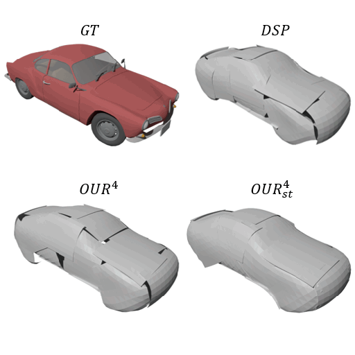
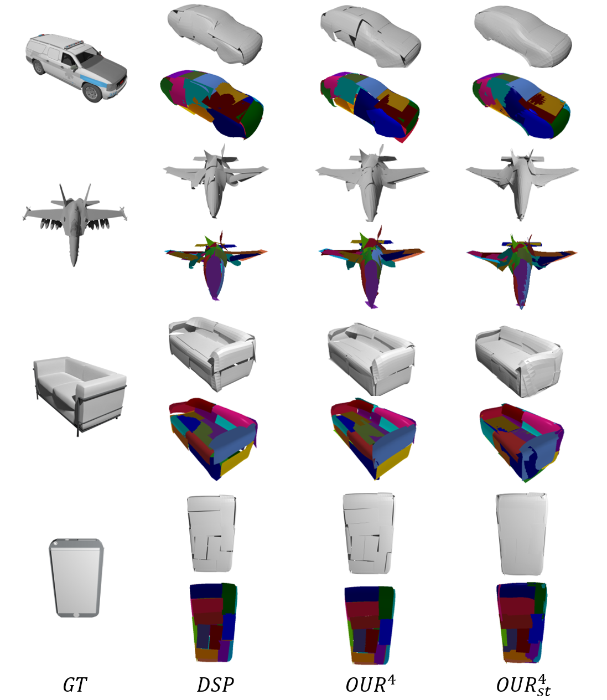
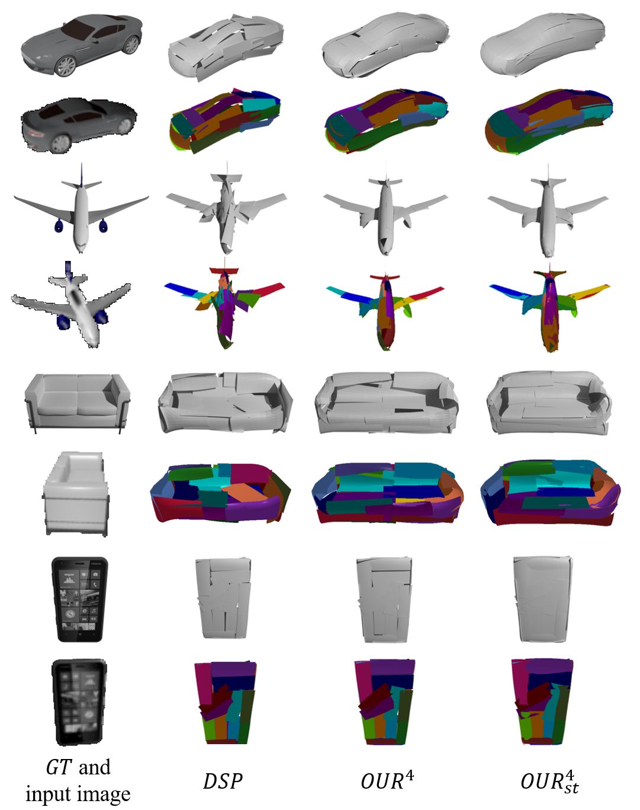

# Better Patch Stitching
This repository contains the official source code of the paper [Better Patch Stitching for Parametric Surface Reconstruction](https://arxiv.org/abs/2010.07021) published in 3DV 2020.



## Dependencies and Dataset
This project is based on the [differential_surface_representation](https://github.com/bednarikjan/differential_surface_representation) and has the same dependencies as it. So, please follow the [Environment](https://github.com/bednarikjan/differential_surface_representation#environment) section to configure the environment. Besides, the dataset which the work relies on, ShapeNet and the precomputed GT surface areas, can be obtained as [this section](https://github.com/bednarikjan/differential_surface_representation#data).

## Run
The scripts, train_PCAE_SN.py and train_SVR_SN.py, reproduce the point cloud auto-encoding (PCAE) and single view reconstruction (SVR) experiments on individual ShapeNet (SN) object categories, respectively. The training parameters are stored in the config.yaml configuration file. Use the following command to train the model (e.g. train_PCAE_SN.py):
```
python train_PCAE_SN.py --conf config.yaml --output path/to/output/dir
```

The losses and training information are printed through tensorboard and can be monitered by:
```
cd path/to/output/dir
tensorboard --logdir=. --port=8008 --bind_all
```
Then open ```http://localhost:8008/``` in browser.
## Results
Qualitative results for point cloud auto-encoding (PCAE) task on ShapeNet.



Qualitative results for single view reconstruction (SVR) task on ShapeNet.



## Citation
```
@article{deng2020better,
  title={Better Patch Stitching for Parametric Surface Reconstruction},
  author={Deng, Zhantao and Bedna{\v{r}}{\'\i}k, Jan and Salzmann, Mathieu and Fua, Pascal},
  journal={arXiv preprint arXiv:2010.07021},
  year={2020}
}
```